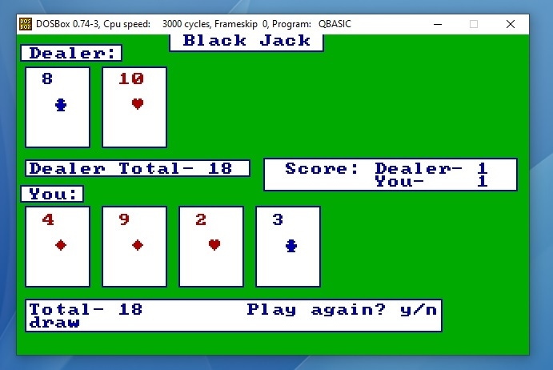

# Qbasic Black Jack for the PC (QBasic) V1.1

# Description 
Update of the original source by Jeff Lewis
http://www.jefflewis.net/programming-qbasic-blakjak.html

## new features
* draw situation added
	
## technology
* Microsoft QBasic (MS Dos)

## requirements
- dosBox
- MS Dos 6.X

**Christian Gellert**

- [Profile](https://github.com/fuerchtegottt "Christian Gellert")
- [Email](mailto:christian.gellert@web.de?subject=Hi% "Hi!")
- [Website](http://www.g3ll3rt.de "Welcome")