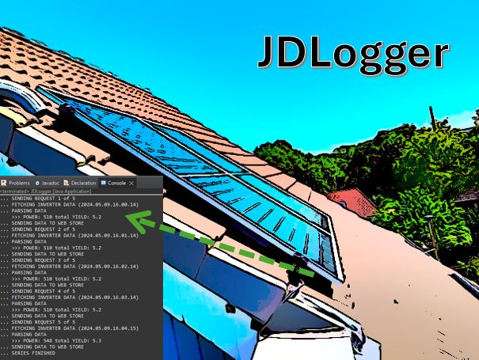

# JDLogger

# description 
JAVA based Deye Inverter Connector

## purpose
reads state data from Deye Micro Inverter DEYE SUN 600 and writes it to console and database storage
	
## features
* reads Deye AP Web State website (basic authentication supported)
* writes data to console and via REST api to a web database
* basic console output
* single poll and interval series poll
* displays current power production stats via simple html
	
## technology
* J2SE
* regex (simple parser)
* http get (basic auth)
* SQL

## task backlog
- [x] deye connector
- [x] console output
- [x] interval mode (iterations / delay)
- [x] PHP rest based web storage of data
- [x] html one-pager to display current state
- [x] animated gif logo (moving arrow from inverter to data sheet
- [x] export database into csv file
- [ ] plot today with https://www.w3schools.com/ai/ai_chartjs.asp
- [ ] calculate correct daily yield from summed power values

## known errors
- value "yield_today" not correct! (w/o internet, the ap does not recognize day change)
(correct value is calculated in php frontend but not saved to database)

**Christian Gellert**

- [Profile](https://github.com/fuerchtegottt "Christian Gellert")
- [Email](mailto:christian.gellert@web.de?subject=Hi% "Hi!")
- [Website](http://www.g3ll3rt.de "Welcome")