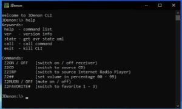

# JDenon
 |  | 

# Description 
java based access layer to DENON AVR 2113 (and compatible) using denon web api

## purpose
control your DENON AVR via http network commands
	
## features
* api class for simple avr operations (focus on zone 2)
* command line interface (CLI) for console access or os scripting
* mobile first - web interface (prototype)
	
## technology
* J2SE
	* http/s communication
	* wraps denon web api (facade)
	* config as properties (e.g. device ip)
	
## supported denon commands
| Command     | Description                     | Example     |      
| ----------- | ------------------------------- | ----------- |
| Z2ON / OFF  | switch zone 2 on / off          | Z2ON        |
| Z2CD        | switch zone 2 to cd             | Z2CD        |
| Z2IRP       | ... to internet radio playback  | ZDIRP       |
| Z2##        | set zone 2 volume (00 - 99)     | Z225        |
| Z2MUON / OFF| mute / unmute zone 2            | Z2MUON      |
| Z2FAVORITE# | switch zone 2 to favorite (1-3) | Z2FAVORITE1 |
	

## task backlog
- [x] base implementation of api (zone2 on/off)
- [ ] use URI-Builder class
- [x] add cli param parser
- [x] add cli interactive mode
- [ ] add javadoc

**Christian Gellert**

- [Profile](https://github.com/fuerchtegottt "Christian Gellert")
- [Email](mailto:christian.gellert@web.de?subject=Hi% "Hi!")
- [Website](http://www.g3ll3rt.de "Welcome")