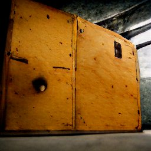

# JPrisonersProblem

*image from dalle-mini (https://www.craiyon.com/)*

# Description 
simple implementation of the 100-Prisoners-Problem in java

## purpose
compare random + follow-strategy in mass test
	
## features
* simple simulation core class
* random- and follow-strategy implemented
* basic console output
	
## technology
* J2SE

## task backlog
- [x] base implementation of api
- [ ] swing ui class for graphical visualisation

**Christian Gellert**

- [Profile](https://github.com/fuerchtegottt "Christian Gellert")
- [Email](mailto:christian.gellert@web.de?subject=Hi% "Hi!")
- [Website](http://www.g3ll3rt.de "Welcome")