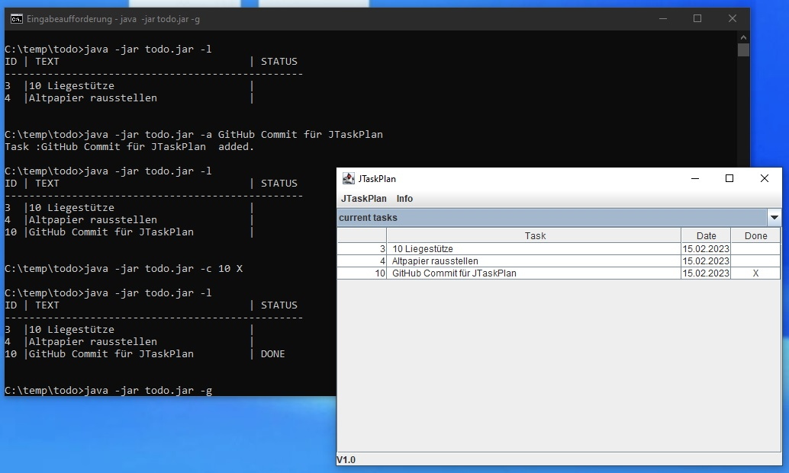

# JTaskPlan

# Description 
lightweight JAVA task planner (productivity tool)


## purpose
simple java example for swing based gui, JTable and basic file operations
	
## features
* create / edit / delete (archive) tasks
* check / uncheck task
* switch view (active tasks / archive)
* Command Line Interface featuring
- adding tasks
- checking / unchecking tasks
- writing active tasks to console

## example CLI calls:
```
java -jar todo.jar -l            ::(print active task list)
java -jar todo.jar -a blahblahb  ::(add a new task)
java -jar todo.jar -c 4 X        ::(check task id 4)
java -jar todo.jar -c 4          ::(uncheck task id 4)
java -jar todo.jar -g            ::(open gui window)
java -jar todo.jar -h            ::(print online help)
java -jar todo.jar -v            ::(show build version)
```
	
## technology
* J2SE
	* SWING GUI
	* JTable
	* proprietary CSV parser / writer



## task backlog
- [x] base implementation
- [x] implement basic CLI
- [ ] encapsule string operations for CLI output
- [ ] use constant for NEWLINE
- [ ] implement status bar
- [ ] add javadoc
- [ ] use dedicated icon

**Christian Gellert**

- [Profile](https://github.com/fuerchtegottt "Christian Gellert")
- [Email](mailto:christian.gellert@web.de?subject=Hi% "Hi!")
- [Website](http://www.g3ll3rt.de "Welcome")