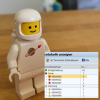

# JWebFeed

# description 
simple web based application log to be used to store event driven messages

## purpose
writes log messages to a db table via php rest service
	
## features
* simple rest service to read / write / delete log entries
* java api
* php based RSS transformation
	
## technology
* J2SE
* http get (basic auth)
* SQL

## task backlog
- [x] db table
- [ ] put.php
- [ ] get.php
- [ ] purge.php
- [ ] getrss.php
- [ ] java api

## known errors
- nothing working so far :)

**Christian Gellert**

- [Profile](https://github.com/fuerchtegottt "Christian Gellert")
- [Email](mailto:christian.gellert@web.de?subject=Hi% "Hi!")
- [Website](http://www.g3ll3rt.de "Welcome")