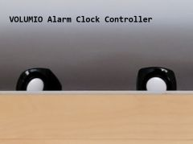

# Web Radio Alarm Clock for VOLUMIO
 

## Description 
sample shell script to control VOLUMIO server by RFC calls

## purpose
build your own web radio alarm clock based on volumio server

## requires:
* raspberry PI 2  (due to low current consumption)
* with USB speakers
* and network access
* remote controler (e.g. linux server / user with cron access)
	
## features
* turn on / off your favorite web radio station
* news / music mode
* week day / weekend - mode
	

## installation
* create favorites in volumio for your favorite music or news radio station
* edit the script according to your favorite names (default is "FluxFM" for music and "DLF" for news)
* drop script in the root folder of your remote controller
* plan cron jobs for MUSIC, NEWS or OFF

## sample calls for CRON
```
* bash alarm.sh wd off    #alarm on week days NEWS
* bash alarm.sh wd music  #alarm on week days MUSIC
* bash alarm.sh wd news   #alarm on week days NEWS
```

## technology
* linux shell script
* simple rest calls

## links
[volumio project](https://volumio.com/en/)

**Christian Gellert**

- [Profile](https://github.com/fuerchtegottt "Christian Gellert")
- [Email](mailto:christian.gellert@web.de?subject=Hi% "Hi!")
- [Website](http://www.g3ll3rt.de "Welcome")