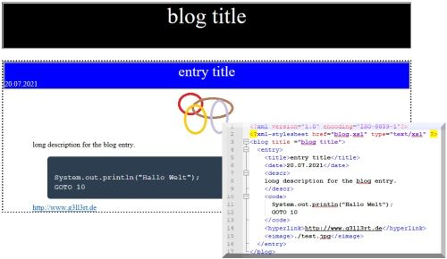

# XMLBlog

# Description 
html/xml based lightweight blog 

## purpose
pattern can  be used to create a simple blog based on an xml data source
	
## features
* XSLT - transformation (XML -> html blog)
* blog entries with link, image, description and source code block
	
## technology
* html
* xml
* xslt
* css
	
## task backlog
- [x] base implementation of transformation
- [x] basic css
- [ ] pimp functional css design

**Christian Gellert**

- [Profile](https://github.com/fuerchtegottt "Christian Gellert")
- [Email](mailto:christian.gellert@web.de?subject=Hi% "Hi!")
- [Website](http://www.g3ll3rt.de "Welcome")